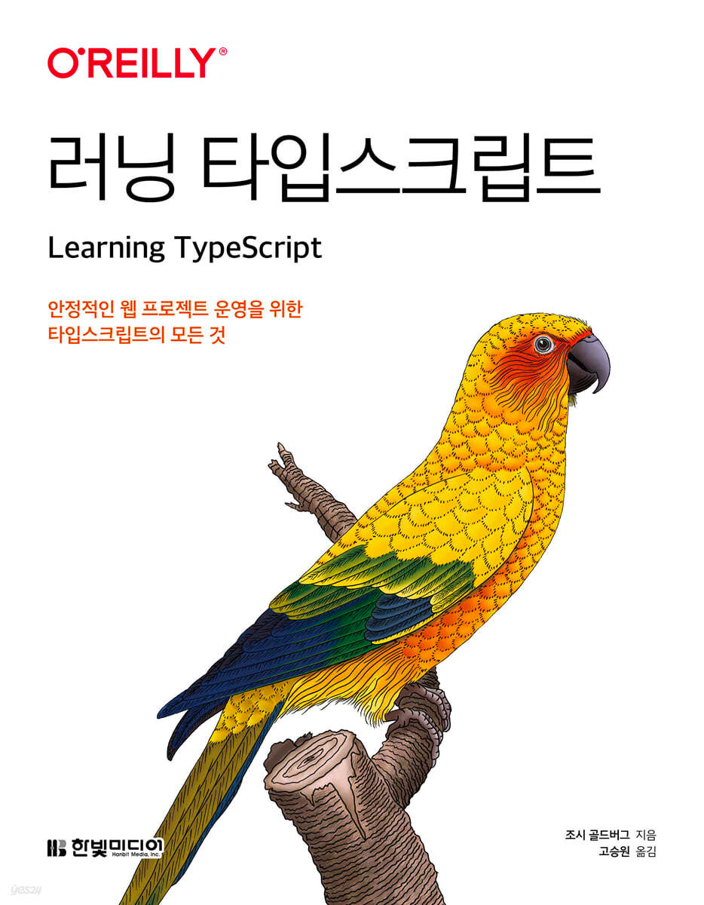

# 책,책,책! 책을 읽어요.

> 기술관련 서적을 읽고 정리하는 레포입니다.

## Books

<table>
<colgroup>
<col width="160"/>
</colgroup>
<head>
<th>
러닝 타입스크립트
</th>
<th>
함께 자라기
</th>
<th>
쏙쏙 들어오는 함수형 코딩
</th>
</head>
<body>
<tr>
<td>

</td>
<td>

</td>
<td>

</td>
</tr>
<tr>
<td align="center"><a href="러닝_타입스크립트/README.md">바로가기</a></td>
<td align="center"><a href="함께_자라기/README.md">바로가기</a></td>
<td align="center"><a href="쏙쏙_들어오는_함수형_코딩/README.md">바로가기</a></td>
</tr>
<table>
<colgroup>
<col width="160"/>
<col width="160"/>
</colgroup>
<head>
<th>
모던 리액트 Deep Dive
</th>
<th>
다시 깊게 익히는 인사이드 리액트
</th>
</head>
<body>
<tr>
<td>

</td>
<td>

</td>
</tr>
<tr>
<td align="center"><a href="모던_리액트_Deep_Dive/README.md">바로가기</a></td>
<td align="center"><a href="다시_깊게_익히는_인사이드_리액트/README.md">바로가기</a></td>
</tr>
</body>
</table>
