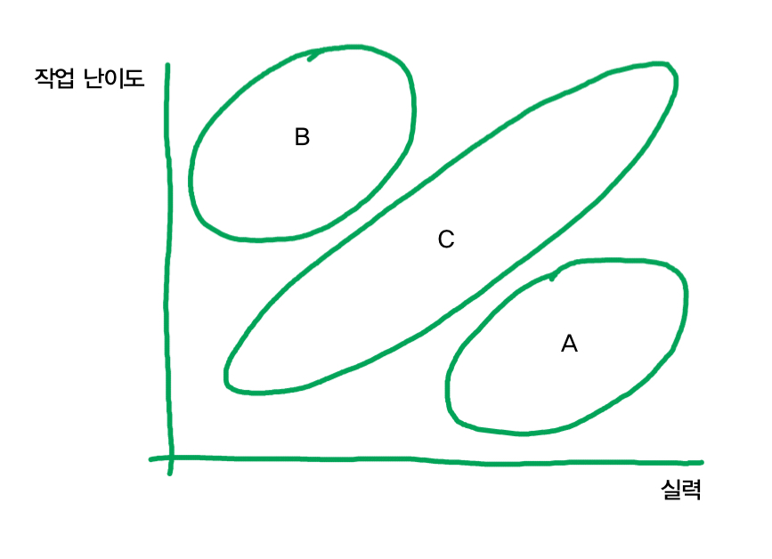
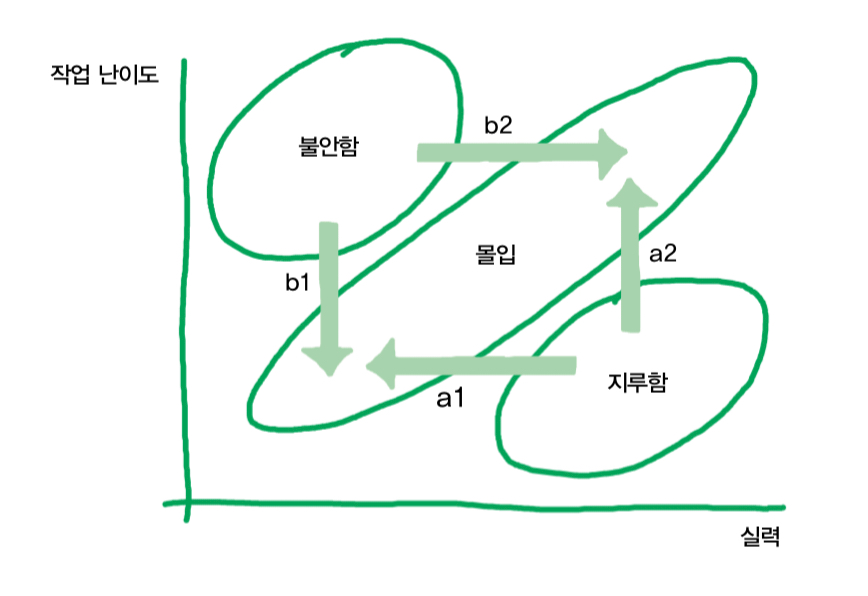

# 자라기 2

실력상승을 원한다면 `의도적인 수련`을 해야 한다.

### 의도적 수련의 필수조건, 적절한 난이도
<table>
<body>
<tr>
<td>

</td>
<td>

</td>
</tr>
</body>
</table>

- A영역 : 실력이 작업 난이도를 초과하는 영역.
**지루함**을 느낀다.
- B영역 : 실력보다 높은 난이도의 일을 하는 영역.
**불안함**을 느낀다.
- C영역 : 난이도와 실력이 엇비슷하게 맞는 무문. 이 부분에서 **몰입**을 경험한다.

A나 B영역은 실력향상에 별 도움이 되지 않는다고 한다.
자신이 업무 시간 중에 불안함이나 지루함을 느끼는 때가 대부분이라면, 실력이 도무지 늘지 않는 환경에 있는 것.

A영역이 제공해주는 안전지대 안에 머무르고, 지루함 속에서 자기 실력에 대해 안심하고, 그 상태에 익숙해지지 말자.

- 지루함을 느끼는 경우
  - a1. 실력 낮추기
  - a3. 난이도 높이기
- 불안함을 느끼는 경우
    - b2. 실력 높이기
    - b1. 난이도 낮추기

----
### 뛰어난 선생에 대한 미신

조직과 개인 들 모두 많은 돈과 시간을 투자해 교육을 받는다.

흥미롭게도 많은 조직에서 교육은 투입으로 성과를 측정하는 대표적 분야.
얼마나 썼냐로 얼마나 잘했냐를 가늠한다는 것.

사실 이러한 훈련은 6개월 정도만 지나도 효과가 사라진다는 연구 분석 결과가 있다.

그러나 교육이 끝나는 시점에는 그렇게 생각이 들지 않았을 것이다.

왜 효과가 별로 없을까?

지식이 많은 사람이라고 해서 꼭 좋은 선생이라고 할 수 없다.
지식이 많은 사람에게 배웠다고 해서 내가 실력이 꼭 느는 것은 아니다.

전문가가 가르쳐주는 것은 전부가 아니기 때문.

### 나홀로 전문가에 대한 미신
어떤 기술적 실천법이라도 그걸 현실에서 적용하기 위해서는 사회적 자본과 기술이 필요하다.

전문가가 해당 도메인 지식만 뛰어난 사람이라는 것은 대표적인 미신.

전문가는 사회적 자본과 사회적 기술 또한 뛰어나다.
뛰어난 개발자들은 약 70%가 동료와의 협력을 언급한다.

